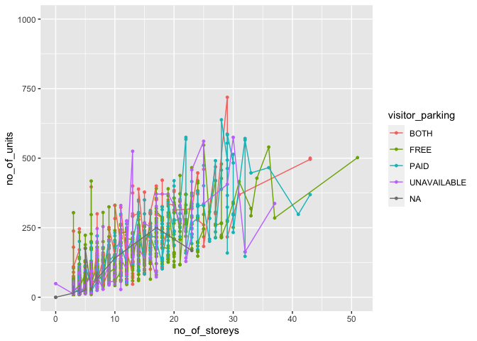
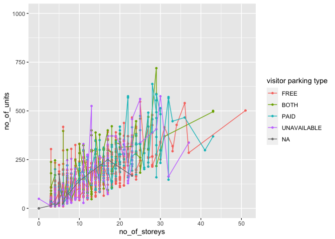
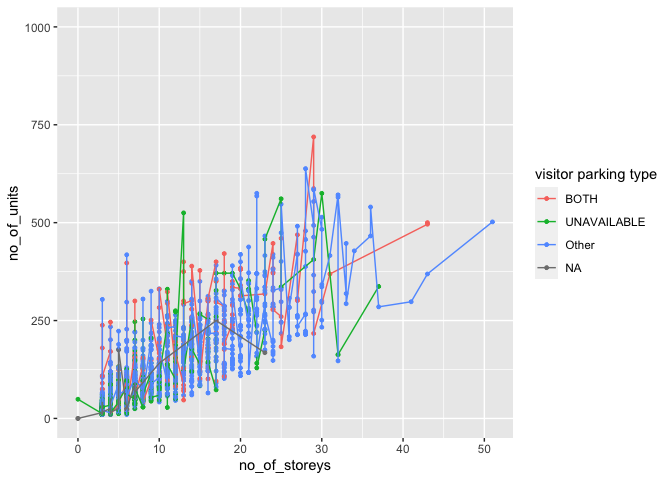

Milestone2
================

*To complete this milestone, you can edit [this `.rmd`
file](https://raw.githubusercontent.com/UBC-STAT/stat545.stat.ubc.ca/master/content/mini-project/mini-project-2.Rmd)
directly. Fill in the sections that are commented out with
`<!--- start your work here--->`. When you are done, make sure to knit
to an `.md` file by changing the output in the YAML header to
`github_document`, before submitting a tagged release on canvas.*

\# Welcome to your second (and last) milestone in your mini data
analysis project!

In Milestone 1, you explored your data, came up with research questions,
and obtained some results by making summary tables and graphs. This
time, we will first explore more in depth the concept of *tidy data.*
Then, you’ll be sharpening some of the results you obtained from your
previous milestone by:

- Manipulating special data types in R: factors and/or dates and times.
- Fitting a model object to your data, and extract a result.
- Reading and writing data as separate files.

**NOTE**: The main purpose of the mini data analysis is to integrate
what you learn in class in an analysis. Although each milestone provides
a framework for you to conduct your analysis, it’s possible that you
might find the instructions too rigid for your data set. If this is the
case, you may deviate from the instructions – just make sure you’re
demonstrating a wide range of tools and techniques taught in this class.

# Instructions

**To complete this milestone**, edit [this very `.Rmd`
file](https://raw.githubusercontent.com/UBC-STAT/stat545.stat.ubc.ca/master/content/mini-project/mini-project-2.Rmd)
directly. Fill in the sections that are tagged with
`<!--- start your work here--->`.

**To submit this milestone**, make sure to knit this `.Rmd` file to an
`.md` file by changing the YAML output settings from
`output: html_document` to `output: github_document`. Commit and push
all of your work to your mini-analysis GitHub repository, and tag a
release on GitHub. Then, submit a link to your tagged release on canvas.

**Points**: This milestone is worth 55 points (compared to the 45 points
of the Milestone 1): 45 for your analysis, and 10 for your entire
mini-analysis GitHub repository. Details follow.

**Research Questions**: In Milestone 1, you chose two research questions
to focus on. Wherever realistic, your work in this milestone should
relate to these research questions whenever we ask for justification
behind your work. In the case that some tasks in this milestone don’t
align well with one of your research questions, feel free to discuss
your results in the context of a different research question.

# Learning Objectives

By the end of this milestone, you should:

- Understand what *tidy* data is, and how to create it using `tidyr`.
- Generate a reproducible and clear report using R Markdown.
- Manipulating special data types in R: factors and/or dates and times.
- Fitting a model object to your data, and extract a result.
- Reading and writing data as separate files.

# Setup

Begin by loading your data and the tidyverse package below:

``` r
library(datateachr) # <- might contain the data you picked!
library(tidyverse)
```

    ## ── Attaching packages ─────────────────────────────────────── tidyverse 1.3.2 ──
    ## ✔ ggplot2 3.3.6      ✔ purrr   0.3.5 
    ## ✔ tibble  3.1.8      ✔ dplyr   1.0.10
    ## ✔ tidyr   1.2.1      ✔ stringr 1.4.1 
    ## ✔ readr   2.1.3      ✔ forcats 0.5.2 
    ## ── Conflicts ────────────────────────────────────────── tidyverse_conflicts() ──
    ## ✖ dplyr::filter() masks stats::filter()
    ## ✖ dplyr::lag()    masks stats::lag()

# Task 1: Tidy your data (15 points)

In this task, we will do several exercises to reshape our data. The goal
here is to understand how to do this reshaping with the `tidyr` package.

A reminder of the definition of *tidy* data:

- Each row is an **observation**
- Each column is a **variable**
- Each cell is a **value**

*Tidy’ing* data is sometimes necessary because it can simplify
computation. Other times it can be nice to organize data so that it can
be easier to understand when read manually.

### 2.1 (2.5 points)

Based on the definition above, can you identify if your data is tidy or
untidy? Go through all your columns, or if you have \>8 variables, just
pick 8, and explain whether the data is untidy or tidy.

<!--------------------------- Start your work below --------------------------->

``` r
head(apt_buildings)
```

    ## # A tibble: 6 × 37
    ##      id air_co…¹ ameni…² balco…³ barri…⁴ bike_…⁵ exter…⁶ fire_…⁷ garba…⁸ heati…⁹
    ##   <dbl> <chr>    <chr>   <chr>   <chr>   <chr>   <chr>   <chr>   <chr>   <chr>  
    ## 1 10359 NONE     Outdoo… YES     YES     0 indo… NO      YES     YES     HOT WA…
    ## 2 10360 NONE     Outdoo… YES     NO      0 indo… NO      YES     YES     HOT WA…
    ## 3 10361 NONE     <NA>    YES     NO      Not Av… NO      YES     NO      HOT WA…
    ## 4 10362 NONE     <NA>    YES     YES     Not Av… YES     YES     NO      HOT WA…
    ## 5 10363 NONE     <NA>    NO      NO      12 ind… NO      YES     NO      HOT WA…
    ## 6 10364 NONE     <NA>    NO      NO      Not Av… <NA>    YES     NO      HOT WA…
    ## # … with 27 more variables: intercom <chr>, laundry_room <chr>,
    ## #   locker_or_storage_room <chr>, no_of_elevators <dbl>, parking_type <chr>,
    ## #   pets_allowed <chr>, prop_management_company_name <chr>,
    ## #   property_type <chr>, rsn <dbl>, separate_gas_meters <chr>,
    ## #   separate_hydro_meters <chr>, separate_water_meters <chr>,
    ## #   site_address <chr>, sprinkler_system <chr>, visitor_parking <chr>,
    ## #   ward <chr>, window_type <chr>, year_built <dbl>, year_registered <dbl>, …

``` r
apt_buildingnew<-apt_buildings %>% 
  select(id,rsn,property_type,exterior_fire_escape,year_built,cooling_room,ward,no_of_storeys)
head(apt_buildingnew)
```

    ## # A tibble: 6 × 8
    ##      id     rsn property_type exterior_fire_escape year_…¹ cooli…² ward  no_of…³
    ##   <dbl>   <dbl> <chr>         <chr>                  <dbl> <chr>   <chr>   <dbl>
    ## 1 10359 4154812 PRIVATE       NO                      1967 NO      17         17
    ## 2 10360 4154815 PRIVATE       NO                      1970 NO      17         14
    ## 3 10361 4155295 PRIVATE       NO                      1927 NO      03          4
    ## 4 10362 4155309 PRIVATE       YES                     1959 NO      03          5
    ## 5 10363 4155318 PRIVATE       NO                      1943 NO      02          4
    ## 6 10364 4155322 PRIVATE       <NA>                    1952 NO      02          4
    ## # … with abbreviated variable names ¹​year_built, ²​cooling_room, ³​no_of_storeys

I select 8 variables which are id, rsn, property_type,
exterior_fire_escape, year_built, cooling_room, ward,no_of_storeys The
data is tidy, because each row is an observation, each column is a
variable, and each cell is a value.
<!----------------------------------------------------------------------------->

### 2.2 (5 points)

Now, if your data is tidy, untidy it! Then, tidy it back to it’s
original state.

If your data is untidy, then tidy it! Then, untidy it back to it’s
original state.

Be sure to explain your reasoning for this task. Show us the “before”
and “after”.

<!--------------------------- Start your work below --------------------------->

**untidy**

``` r
apt_building_untidy<-apt_buildingnew %>%
  pivot_wider(names_from = property_type,values_from =rsn)
head(apt_building_untidy)
```

    ## # A tibble: 6 × 9
    ##      id exterior_fire_escape year_…¹ cooli…² ward  no_of…³ PRIVATE  TCHC SOCIA…⁴
    ##   <dbl> <chr>                  <dbl> <chr>   <chr>   <dbl>   <dbl> <dbl>   <dbl>
    ## 1 10359 NO                      1967 NO      17         17 4154812    NA      NA
    ## 2 10360 NO                      1970 NO      17         14 4154815    NA      NA
    ## 3 10361 NO                      1927 NO      03          4 4155295    NA      NA
    ## 4 10362 YES                     1959 NO      03          5 4155309    NA      NA
    ## 5 10363 NO                      1943 NO      02          4 4155318    NA      NA
    ## 6 10364 <NA>                    1952 NO      02          4 4155322    NA      NA
    ## # … with abbreviated variable names ¹​year_built, ²​cooling_room, ³​no_of_storeys,
    ## #   ⁴​`SOCIAL HOUSING`

**re-tidy**

``` r
apt_building_retidy<-apt_building_untidy %>% group_by(id)%>%
 pivot_longer(cols = c("PRIVATE","TCHC","SOCIAL HOUSING"),
               names_to = "property_type",
               values_to = "rsn",
              values_drop_na = T) 
  head(apt_building_retidy)
```

    ## # A tibble: 6 × 8
    ## # Groups:   id [6]
    ##      id exterior_fire_escape year_built cooling_r…¹ ward  no_of…² prope…³    rsn
    ##   <dbl> <chr>                     <dbl> <chr>       <chr>   <dbl> <chr>    <dbl>
    ## 1 10359 NO                         1967 NO          17         17 PRIVATE 4.15e6
    ## 2 10360 NO                         1970 NO          17         14 PRIVATE 4.15e6
    ## 3 10361 NO                         1927 NO          03          4 PRIVATE 4.16e6
    ## 4 10362 YES                        1959 NO          03          5 PRIVATE 4.16e6
    ## 5 10363 NO                         1943 NO          02          4 PRIVATE 4.16e6
    ## 6 10364 <NA>                       1952 NO          02          4 PRIVATE 4.16e6
    ## # … with abbreviated variable names ¹​cooling_room, ²​no_of_storeys,
    ## #   ³​property_type

**explanation** I untidy the data by showing the different property type
and its related rsn number, then I use pivot_longer function to tidy the
dataset to its original format
<!----------------------------------------------------------------------------->

### 2.3 (7.5 points)

Now, you should be more familiar with your data, and also have made
progress in answering your research questions. Based on your interest,
and your analyses, pick 2 of the 4 research questions to continue your
analysis in the next four tasks:

<!-------------------------- Start your work below ---------------------------->

1.  *After 1990，in each property type, do The apartments with more
    no_barrier_free_accessible_units tend to have more number of
    accessible parking?*
2.  *After 1990， in each property type, do the apartments with more
    units tend to have more storeys*

<!----------------------------------------------------------------------------->

Explain your decision for choosing the above two research questions.

<!--------------------------- Start your work below --------------------------->

There may be certain relationship that exists for having
no_barrier_free_accessible_units and the number of accessible parking as
well as the number of units and storeys. It can help us to understand
the situation of accessible facilities and the apartment trends in city
However,property type may impact the relationship, so I want to look at
the relationship in each property type. This relationship is important
for urban planning. And I want to look into the newer data as the house
built after not included 1989.
<!----------------------------------------------------------------------------->

Now, try to choose a version of your data that you think will be
appropriate to answer these 2 questions. Use between 4 and 8 functions
that we’ve covered so far (i.e. by filtering, cleaning, tidy’ing,
dropping irrelevant columns, etc.).

<!--------------------------- Start your work below --------------------------->

``` r
apt_building1<-apt_buildings %>%
  filter(year_built > 1989) %>%
  select(id,property_type,no_barrier_free_accessible_units,no_of_accessible_parking_spaces,no_of_storeys,no_of_units)%>% 
 arrange(property_type)%>%
 group_by(property_type)
head(apt_building1)
```

    ## # A tibble: 6 × 6
    ## # Groups:   property_type [1]
    ##      id property_type no_barrier_free_accessible_units no_of_a…¹ no_of…² no_of…³
    ##   <dbl> <chr>                                    <dbl>     <dbl>   <dbl>   <dbl>
    ## 1 10386 PRIVATE                                      0         0       9     116
    ## 2 10389 PRIVATE                                      5        17       3      17
    ## 3 10392 PRIVATE                                      2         3      10     153
    ## 4 10471 PRIVATE                                      0         0       3      15
    ## 5 10478 PRIVATE                                      0         0       3      19
    ## 6 10524 PRIVATE                                      0         2      36     466
    ## # … with abbreviated variable names ¹​no_of_accessible_parking_spaces,
    ## #   ²​no_of_storeys, ³​no_of_units

<!----------------------------------------------------------------------------->

# Task 2: Special Data Types (10)

For this exercise, you’ll be choosing two of the three tasks below –
both tasks that you choose are worth 5 points each.

                                                                                                    But first, tasks 1 and 2 below ask you to modify a plot you made in a previous milestone. The plot you choose should involve plotting across at least three groups (whether by facetting, or using an aesthetic like colour). Place this plot below (you're allowed to modify the plot if you'd like). If you don't have such a plot, you'll need to make one. Place the code for your plot below.
                                                                                                                                                                   
                                                                                                    <!-------------------------- Start your work below ---------------------------->

``` r
graph1<-apt_buildings %>%
ggplot(aes(x=no_of_storeys,y=no_of_units,color=visitor_parking)) +
geom_point(size=1)+
 geom_line()+ylim(0,1000)
graph1
```

    ## Warning: Removed 1 rows containing missing values (geom_point).

<!-- -->

                                                                                                                                                                     <!----------------------------------------------------------------------------->
                                                                                                                                                                     
                                                                                                     Now, choose two of the following tasks.
                                                                                                                                                                   

1.  Produce a new plot that reorders a factor in your original plot,
    using the `forcats` package (3 points). Then, in a sentence or two,
    briefly explain why you chose this ordering (1 point here for
    demonstrating understanding of the reordering, and 1 point for
    demonstrating some justification for the reordering, which could be
    subtle or speculative.)

                                                                                                    2.  Produce a new plot that groups some factor levels together into an "other" category (or something similar), using the `forcats` package (3 points). Then, in a sentence or two, briefly explain why you chose this grouping (1 point here for demonstrating understanding of the grouping, and 1 point for demonstrating some justification for the grouping, which could be subtle or speculative.)

                                                                                                    3.  If your data has some sort of time-based column like a date (but something more granular than just a year):

                                                                                                    1.  Make a new column that uses a function from the `lubridate` or `tsibble` package to modify your original time-based column. (3 points)

                                                                                                  Note that you might first have to *make* a time-based column using a function like `ymd()`, but this doesn't count.
        -   Examples of something you might do here: extract the day of the year from a date, or extract the weekday, or let 24 hours elapse on your dates.

    2.  Then, in a sentence or two, explain how your new column might be
        useful in exploring a research question. (1 point for
        demonstrating understanding of the function you used, and 1
        point for your justification, which could be subtle or
        speculative).

        - For example, you could say something like “Investigating the
          day of the week might be insightful because penguins don’t
          work on weekends, and so may respond differently”.

<!-------------------------- Start your work below ---------------------------->

**Task Number**: Task 1

``` r
graph1<-apt_buildings %>%
ggplot(aes(x=no_of_storeys,y=no_of_units,color=fct_reorder2(visitor_parking,no_of_storeys,no_of_units))) +
geom_point(size=1)+
 geom_line()+ylim(0,1000)+labs(color= "visitor parking type")
graph1
```

    ## Warning: Removed 1 rows containing missing values (geom_point).

<!-- --> The
reason I took the this order is that I would like the reader to find the
graph easy to read. The order first ordered based the x value, then
ordered based the y value, which resulted in the the line with the
highest order by visual was ordered with the first color which is red.

<!----------------------------------------------------------------------------->
<!-------------------------- Start your work below ---------------------------->

**Task Number**: 2

``` r
graph1<-apt_buildings %>% 
ggplot(aes(x=no_of_storeys,y=no_of_units,color=fct_other(visitor_parking,drop  = c( "PAID","FREE")))) +
geom_point(size=1)+
 geom_line()+ylim(0,1000)+labs(color= "visitor parking type")
graph1 
```

    ## Warning: Removed 1 rows containing missing values (geom_point).

<!-- --> I put
paid and free together,as group them toghter reflect the apartments that
would have at least one type of visitor parking.
<!----------------------------------------------------------------------------->

# Task 3: Modelling

## 2.0 (no points)

Pick a research question, and pick a variable of interest (we’ll call it
“Y”) that’s relevant to the research question. Indicate these.

<!-------------------------- Start your work below ---------------------------->

**Research Question**: What’s the relationship between year of built and
the number of units

**Variable of interest**: number of units

<!----------------------------------------------------------------------------->

## 2.1 (5 points)

Fit a model or run a hypothesis test that provides insight on this
variable with respect to the research question. Store the model object
as a variable, and print its output to screen. We’ll omit having to
justify your choice, because we don’t expect you to know about model
specifics in STAT 545.

- **Note**: It’s OK if you don’t know how these models/tests work. Here
  are some examples of things you can do here, but the sky’s the limit.

  - You could fit a model that makes predictions on Y using another
    variable, by using the `lm()` function.
  - You could test whether the mean of Y equals 0 using `t.test()`, or
    maybe the mean across two groups are different using `t.test()`, or
    maybe the mean across multiple groups are different using `anova()`
    (you may have to pivot your data for the latter two).
  - You could use `lm()` to test for significance of regression.

<!-------------------------- Start your work below ---------------------------->

``` r
apt_units<-lm(year_registered ~no_of_units, data=apt_buildings)
apt_units
```

    ## 
    ## Call:
    ## lm(formula = year_registered ~ no_of_units, data = apt_buildings)
    ## 
    ## Coefficients:
    ## (Intercept)  no_of_units  
    ##   2.017e+03   -2.471e-04

<!----------------------------------------------------------------------------->

## 2.2 (5 points)

Produce something relevant from your fitted model: either predictions on
Y, or a single value like a regression coefficient or a p-value.

- Be sure to indicate in writing what you chose to produce.
- Your code should either output a tibble (in which case you should
  indicate the column that contains the thing you’re looking for), or
  the thing you’re looking for itself.
- Obtain your results using the `broom` package if possible. If your
  model is not compatible with the broom function you’re needing, then
  you can obtain your results by some other means, but first indicate
  which broom function is not compatible.

<!-------------------------- Start your work below ---------------------------->

``` r
library(broom)
apt_units_tidy<-tidy(apt_units)
apt_units_tidy
```

    ## # A tibble: 2 × 5
    ##   term           estimate std.error statistic   p.value
    ##   <chr>             <dbl>     <dbl>     <dbl>     <dbl>
    ## 1 (Intercept) 2017.       0.00921   219087.   0        
    ## 2 no_of_units   -0.000247 0.0000613     -4.03 0.0000574

``` r
augment(apt_units)
```

    ## # A tibble: 3,366 × 9
    ##    .rownames year_regi…¹ no_of…² .fitted   .resid    .hat .sigma .cooksd .std.…³
    ##    <chr>           <dbl>   <dbl>   <dbl>    <dbl>   <dbl>  <dbl>   <dbl>   <dbl>
    ##  1 1                2017     218   2017. -0.0917  6.32e-4  0.420 1.51e-5 -0.219 
    ##  2 2                2017     206   2017. -0.0947  5.71e-4  0.420 1.45e-5 -0.226 
    ##  3 3                2017      34   2017. -0.137   3.71e-4  0.420 1.98e-5 -0.327 
    ##  4 4                2017      42   2017. -0.135   3.52e-4  0.420 1.83e-5 -0.322 
    ##  5 5                2017      25   2017. -0.139   3.95e-4  0.420 2.18e-5 -0.332 
    ##  6 7                2017      14   2017. -0.142   4.29e-4  0.420 2.46e-5 -0.339 
    ##  7 8                2017     105   2017. -0.120   3.00e-4  0.420 1.22e-5 -0.285 
    ##  8 9                2017     571   2017. -0.00453 5.17e-3  0.420 3.04e-7 -0.0108
    ##  9 10               2017     171   2017. -0.103   4.28e-4  0.420 1.30e-5 -0.246 
    ## 10 11               2018      26   2017.  0.861   3.92e-4  0.420 8.24e-4  2.05  
    ## # … with 3,356 more rows, and abbreviated variable names ¹​year_registered,
    ## #   ²​no_of_units, ³​.std.resid

I would like to use tidy to construct a tibble that summarizee the
model’s statistic findings, this includes the standard errors and
p-valus.I would like also use the augument function to see the original
data with information fro the model.
<!----------------------------------------------------------------------------->

# Task 4: Reading and writing data

Get set up for this exercise by making a folder called `output` in the
top level of your project folder / repository. You’ll be saving things
there.

## 3.1 (5 points)

Take a summary table that you made from Milestone 1 (Task 4.2), and
write it as a csv file in your `output` folder. Use the `here::here()`
function.

- **Robustness criteria**: You should be able to move your Mini Project
  repository / project folder to some other location on your computer,
  or move this very Rmd file to another location within your project
  repository / folder, and your code should still work.
- **Reproducibility criteria**: You should be able to delete the csv
  file, and remake it simply by knitting this Rmd file.

<!-------------------------- Start your work below ---------------------------->

``` r
apt_storeys<-apt_buildings %>% select(id,no_of_storeys)
apt_storeys$storey_variable <- cut(apt_storeys$no_of_storeys,
                      breaks=c(-Inf,4, 7, Inf),
                       labels=c('Low', 'Medium', 'high'))
apt_storeys
```

    ## # A tibble: 3,455 × 3
    ##       id no_of_storeys storey_variable
    ##    <dbl>         <dbl> <fct>          
    ##  1 10359            17 high           
    ##  2 10360            14 high           
    ##  3 10361             4 Low            
    ##  4 10362             5 Medium         
    ##  5 10363             4 Low            
    ##  6 10364             4 Low            
    ##  7 10365             4 Low            
    ##  8 10366             7 Medium         
    ##  9 10367            32 high           
    ## 10 10368             4 Low            
    ## # … with 3,445 more rows

``` r
here::here()
```

    ## [1] "/Users/yiweiyin/Google Drive/UBC/STAT 545/Yiwei-Yin-_minidata_2"

``` r
dir.create(here::here("output"))
```

    ## Warning in dir.create(here::here("output")): '/Users/yiweiyin/Google Drive/UBC/
    ## STAT 545/Yiwei-Yin-_minidata_2/output' already exists

``` r
write_csv(apt_storeys, here::here("output", "storyes review.csv"))
```

<!----------------------------------------------------------------------------->

## 3.2 (5 points)

Write your model object from Task 3 to an R binary file (an RDS), and
load it again. Be sure to save the binary file in your `output` folder.
Use the functions `saveRDS()` and `readRDS()`.

- The same robustness and reproducibility criteria as in 3.1 apply here.

<!-------------------------- Start your work below ---------------------------->

``` r
saveRDS(apt_units_tidy, here::here("output","mini_project_2_apt_units.rds"))
apt_units_test<-readRDS(here::here("output","mini_project_2_apt_units.rds"))
apt_units_test
```

    ## # A tibble: 2 × 5
    ##   term           estimate std.error statistic   p.value
    ##   <chr>             <dbl>     <dbl>     <dbl>     <dbl>
    ## 1 (Intercept) 2017.       0.00921   219087.   0        
    ## 2 no_of_units   -0.000247 0.0000613     -4.03 0.0000574

<!----------------------------------------------------------------------------->

# Tidy Repository

Now that this is your last milestone, your entire project repository
should be organized. Here are the criteria we’re looking for.

## Main README (3 points)

There should be a file named `README.md` at the top level of your
repository. Its contents should automatically appear when you visit the
repository on GitHub.

Minimum contents of the README file:

- In a sentence or two, explains what this repository is, so that
  future-you or someone else stumbling on your repository can be
  oriented to the repository.
- In a sentence or two (or more??), briefly explains how to engage with
  the repository. You can assume the person reading knows the material
  from STAT 545A. Basically, if a visitor to your repository wants to
  explore your project, what should they know?

Once you get in the habit of making README files, and seeing more README
files in other projects, you’ll wonder how you ever got by without them!
They are tremendously helpful.

## File and Folder structure (3 points)

You should have at least three folders in the top level of your
repository: one for each milestone, and one output folder. If there are
any other folders, these are explained in the main README.

Each milestone document is contained in its respective folder, and
nowhere else.

Every level-1 folder (that is, the ones stored in the top level, like
“Milestone1” and “output”) has a `README` file, explaining in a sentence
or two what is in the folder, in plain language (it’s enough to say
something like “This folder contains the source for Milestone 1”).

## Output (2 points)

All output is recent and relevant:

- All Rmd files have been `knit`ted to their output, and all data files
  saved from Task 4 above appear in the `output` folder.
- All of these output files are up-to-date – that is, they haven’t
  fallen behind after the source (Rmd) files have been updated.
- There should be no relic output files. For example, if you were
  knitting an Rmd to html, but then changed the output to be only a
  markdown file, then the html file is a relic and should be deleted.

Our recommendation: delete all output files, and re-knit each
milestone’s Rmd file, so that everything is up to date and relevant.

PS: there’s a way where you can run all project code using a single
command, instead of clicking “knit” three times. More on this in STAT
545B!

## Error-free code (1 point)

This Milestone 1 document knits error-free, and the Milestone 2 document
knits error-free.

Plots failing to show up on Github in the .md counts as an error here.
So does the entire .md failing to show up on Github in the .md (“Sorry
about that, but we can’t show files that are this big right now”).

## Tagged release (1 point)

You’ve tagged a release for Milestone 1, and you’ve tagged a release for
Milestone 2.

### Attribution

Thanks to Victor Yuan for mostly putting this together.
